# TEAF Snippets for vscode

This extension contains snippets for TEAF development.

## Supported languaguages
* React
* Typescript

## Snippets
Bellow are listed supported snippets

### General snippets
| Trigger  | Content |
| :------- | ------- |
| `interfaceInstanceOf→`   | Creates a new Interface with support of `instanceof` comparison|
| `rfc→`   | Template for typed react functional component |
| `useState→`   | Creates strongly typed `useState` with default value |
| `useEffect→`   | Creates template for `useEffect` with optional cleanup function |
| `destruct→`   | Object destructing |

### Redux Actions Snippets
| Trigger  | Content |
| :------- | ------- |
| `actionCreator→`   | Creates a redux action creator |
| `actionInterface→`   | Creates an interface for redux action |
| `actionConstant→`   | Creates constant name for redux action |

### Import/Export snippets
| Trigger  | Content |
| :------- | ------- |
| `expall→`   | Export all from package |
| `ims→`   | Import sinon package |
| `imf→`   | Import { `whatever` } from "`some package`" |
| `imrc→`   | Inserts imports for redux connected components |

### Connected Components Snippets
| Trigger  | Content |
| :------- | ------- |
| `omitContainerProps→` | Creates template for connected component props |
| `stateProps→` | Creates StateProps type |
| `dispatchProps→` | Creates DispatchProps type |
| `connect→` | Connects presentational component with props |
| `mapStateToProps→` | Creates `mapStateToProps` variable used when connecting presentational components |
| `createMapStateToProps→` | Creates function `createMapStateToProps` returning `MapStateToProps` |
| `mapDispatchToProps→` | Creates `mapDispatchToProps` variable used when connecting presentational components |


# Samples
## General snippets
### Interface with instanceof 
Creates a new Interface with support of `instanceof` comparison.
 #### Placeholders
 * Action Name (required)
 * Extends (optional)
 * Properties (optional)
 * Methods (optional)
 * Interfaces (optional)
 * Conditions in `instanceof` (optional)
  
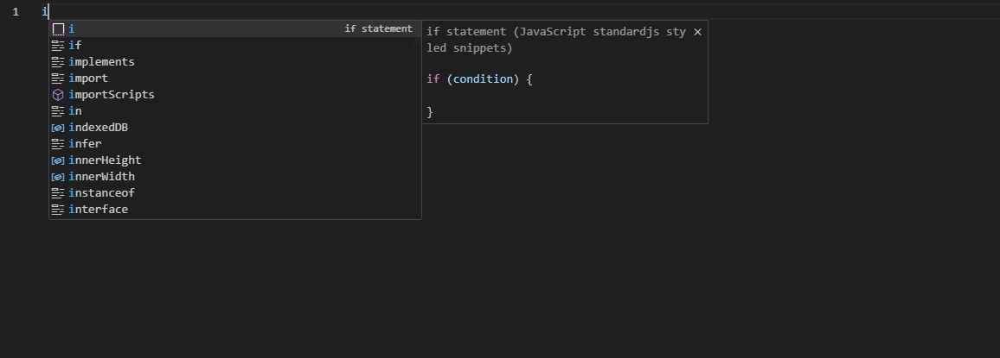

### React Functional Component 
Template for typed react functional component.
 #### Placeholders
 * Component Name (required, name of file is default value)
 * BemClassName (optional)
 * Props (optional, `children` default value)
 * JSDoc (optional)
  
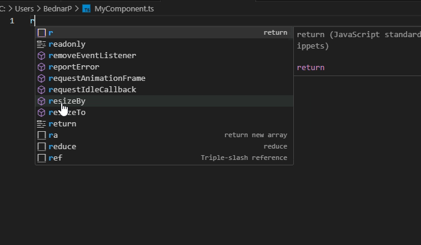

### useState
Creates strongly typed `useState` with default value.

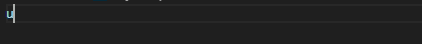

### useEffect
Creates template for `useEffect` with optional cleanup function.

 #### Placeholders
 * Dependency Array (optional)
 * Cleanup function (optional)
 * JSDoc (optional)

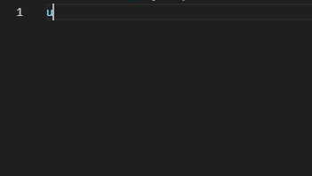

### Object destructing (`destruct`)
Picks members from an object and place them in standalone variables
#### Placeholders
 * Object Name (required)
 * Variable names (required)
 * Rest properties (optional)

 ```ts
 const { variable1, variable1, ...rest} = objectName;
 ```
 

## Redux Actions Snippets
### Action Creator (`actionCreator`)
 Creates a redux action creator. 
 #### Placeholders
 * Action Name (required)
 * Payload (optional)
 * Meta (optional)
 * JSDoc (optional)
  
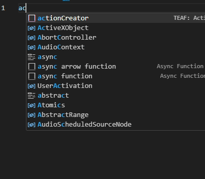

### Action Interface (`actionInterface`)
 Creates an interface for redux action
 #### Placeholders
 * Action Name (required)
 * Extends (optional)
 * Payload (optional)
 * JSDoc (optional)
  
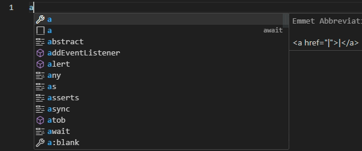

### Action Name Constant (`actionConstant`)
 Creates constant name for redux action
#### Placeholders
 * Action Name (required)

 ```ts
 export const ACTION_NAME = createActionType("ACTION_NAME");
 ```

## Import/Export snippets (`expall`)
### Export all
Creates syntax for export all from package.

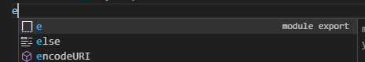

### Import sinon package (`ims`)
creates import for sinon package.

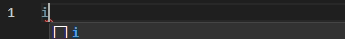

### Import { `whatever` } from "`some package`" (`imf`)

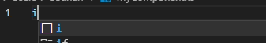

### Import redux stuff for connected components (`imrc`)
Creates type imports from `react` and `react-redux` a `multiweb/types/react` packages needed for connecting componens (i.e. types `MapStateProps`, `IAppState` and others). Also creates import for presentational component and its props.

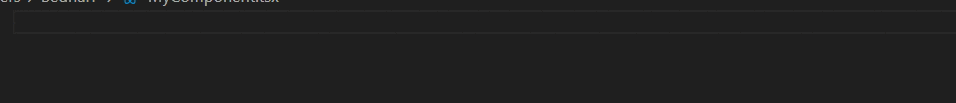

## Connected Components Snippets
### OmitCointerProps
Snippet used when connection presentational component to redux. It creates props for connected component and omits props connected in StateProps or DispatchProps. 

 #### Placeholders
 * Component Name (required, name of file is default value)
 * Own props (optional)
 * JSDoc (optional)

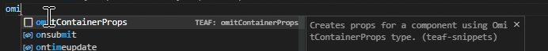

### stateProps
Creates `StateProps` type picking props from presentational component.
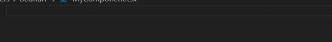

### dispatchProps
Creates `DispatchProps` type picking props from presentational component.
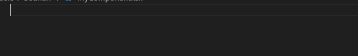

### connect
Connects presentational component with props.
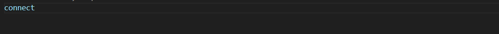

### mapStateToProps
Creates `mapStateToProps` variable used when connecting presentational components.
 #### Placeholders
 * Component Name (required, name of file is default value)
 * Create `StateProps` or skip them (optional)
 * Own component props entering mapStateToProps (optional)

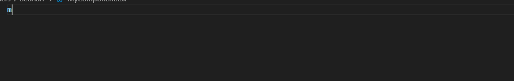

### createMapStateToProps
Creates function `createMapStateToProps` returning `MapStateToProps.
 #### Placeholders
 * Component Name (required, name of file is default value)
 * Create `StateProps` or skip them (optional)
 * Own component props entering mapStateToProps (optional)

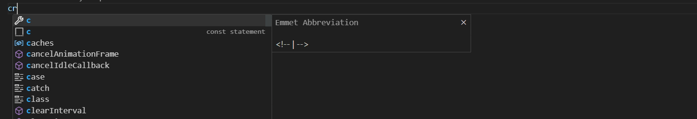

### mapDispatchToProps
Creates `mapDispatchToProps` variable used when connecting presentational components.
 #### Placeholders
 * Component Name (required, name of file is default value)
 * Create `DispatchProps` or skip them (optional)
 * Own component props entering mapStateToProps (optional)

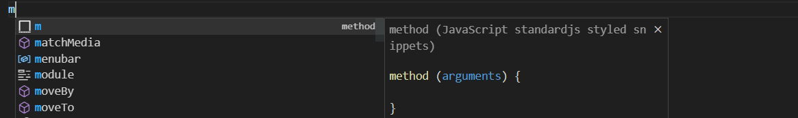